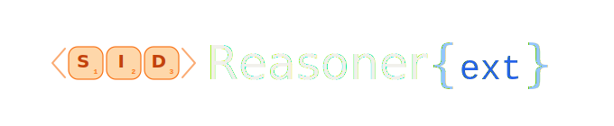

<div align="center">
  
  <h3>Replicating and Extending SIDReasoner</h3>
  
  
  <a href="https://huggingface.co/Dam2/SIDReasoner_Ext/tree/main"></a>
  <br><br>
  <a href="https://huggingface.co/Dam2/SIDReasoner_Ext/tree/main">🤗 Checkpoints & Artifacts</a> | <a href="https://github.com/Alongoodall/SIDReasoner">💻 Repository</a>
</div>

---

**SIDReasoner Reproduction + Extensions** reproduces and extends the [SIDReasoner](https://github.com/HappyPointer/SIDReasoner) framework on Amazon Office Products, providing a fully local-executable pipeline spanning **SFT alignment**, **reasoning activation**, and recommendation-oriented **reinforcement learning (RL)**, along with ablations over alignment stages, RL format (reasoning vs. no-think).


## Environment Setup

### 1) Clone

```bash
git clone https://github.com/Alongoodall/SIDReasoner.git
cd SIDReasoner
```

### 2) Python environment (recommended: uv)

The project requires **Python 3.10** exactly (pinned in `pyproject.toml`).

```bash
# Install uv if not already available
curl -LsSf https://astral.sh/uv/install.sh | sh

# Create venv and install all dependencies
uv sync --python 3.10
source .venv/bin/activate
```

If you prefer standard pip, a pinned `requirements.txt` is provided:

```bash
python3.10 -m venv .venv
source .venv/bin/activate
pip install -r requirements.txt
```

> **Note:** `flash-attn` and `flashinfer` are compiled against CUDA 12 + PyTorch 2.6. Both the `uv sync` and `pip install -r requirements.txt` paths resolve pre-built wheels automatically; building from source may require `--no-build-isolation`.

### 3) Core dependencies (installed automatically)
- torch, transformers, datasets, peft
- pandas, numpy, fire, wandb, tqdm
- accelerate, bitsandbytes
- flash-attn, flashinfer
- verl (for RL stage)

---

## How to pass parameters to scripts

All scripts under `scripts/` read configuration from **environment variables** with sensible defaults. Pass overrides as environment variable prefixes on the command line:

```bash
CATEGORY=Office_Products BASE_MODEL=Qwen/Qwen3-1.7B bash scripts/preprocess_sft.sh
```

Do **not** write `bash scripts/preprocess_sft.sh CATEGORY=... BASE_MODEL=...` — that syntax passes the strings as positional arguments to the underlying Python script, not as shell variables.

Scripts source `scripts/snellius_env.sh`, which auto-detects `uv` and sets `PYTHON_CMD`/`TORCHRUN_CMD`. This works correctly both on Snellius (SLURM) and locally.

---

## Data layout (expected)

```
data/Amazon/
├── train/   Office_Products_5_2016-10-2018-11.csv
├── valid/   Office_Products_5_2016-10-2018-11.csv
├── test/    Office_Products_5_2016-10-2018-11.csv
├── info/    Office_Products_5_2016-10-2018-11.txt
├── index/   Office_Products.index.json
│            Office_Products.item.json
│            Office_Products.item_enhanced_v2.json
│            Office_Products.integrated_narrative.csv
└── general/ sampled_data.arrow
```

RL training additionally expects preprocessed parquet files at:

```
data/Amazon/rec_reasoning_verl/<CATEGORY>/train.parquet
data/Amazon/rec_reasoning_verl/<CATEGORY>/test.parquet
```

---

## Reproduction pipeline

### Stage 1 — SFT preprocessing

```bash
CATEGORY=Office_Products BASE_MODEL=Qwen/Qwen3-1.7B bash scripts/preprocess_sft.sh
```

### Stage 1 — SFT training

```bash
CATEGORY=Office_Products \
BASE_MODEL=Qwen/Qwen3-1.7B \
CUDA_DEVICES=0,1,2,3 \
NPROC_PER_NODE=4 \
bash scripts/train_sft.sh
```

### Stage 2 — Reasoning activation

```bash
CATEGORY=Office_Products \
BASE_MODEL=./output_dir/Office_Products_stage1_sft_Qwen3-1.7B/final_checkpoint \
CUDA_DEVICES=0,1,2,3 \
NPROC_PER_NODE=4 \
bash scripts/sft_reasoning_activation.sh
```

### Create reasoning RL data

```bash
python scripts/create_reasoning_rl_data.py \
  --train_data_dir ./data/Amazon/index/Office_Products.integrated_narrative.csv \
  --eval_data_dir  ./data/Amazon/test/Office_Products_5_2016-10-2018-11.csv \
  --local_dir      ./data/Amazon/rec_reasoning_verl/Office_Products \
  --item_file      ./data/Amazon/index/Office_Products.item.json \
  --index_file     ./data/Amazon/index/Office_Products.index.json
```

### Stage 3 — RL (reasoning / thinking GRPO)

```bash
CATEGORY=Office_Products \
STAGE2_CHECKPOINT=./output_dir/Office_Products_stage2_reasoning_activation_Qwen3-1.7B/final_checkpoint \
N_GPUS_PER_NODE=4 \
NNODES=1 \
bash scripts/RL_training_script.sh
```

### Merge FSDP checkpoint (single step)

```bash
CKPT_DIR=./checkpoints/RecRL_Reasoning/Office_Products_stage3_rl_Qwen3-1.7B/global_step_100/actor \
bash scripts/merge_fsdp_ckpt.sh
```

### Merge all periodic checkpoints

```bash
CKPT_ROOT=./checkpoints/RecRL_Reasoning/Office_Products_stage3_rl_Qwen3-1.7B \
EVAL_INTERVAL=100 \
bash scripts/merge_fsdp_ckpt_ALL.sh
```

---

## Evaluation commands

### Standard (no-think) eval

```bash
CATEGORY=Office_Products \
EXP_NAME=./output_dir/Office_Products_stage1_sft_Qwen3-1.7B/final_checkpoint \
CUDA_LIST="0 1" \
CUDA_LIST_CSV="0,1" \
bash scripts/evaluate_Qwen3.sh
```

Results are written to `./results/<exp_name>/final_result_<CATEGORY>.json`.

### Think eval (batch/multi-model)

Results are written to `./results/<exp_name>/final_result_thinking_<CATEGORY>.json`.

```bash
CATEGORIES=Office_Products \
EXP_LIST="./output_dir/Office_Products_stage2_reasoning_activation_Qwen3-1.7B/final_checkpoint" \
CUDA_LIST="0 1 2" \
CUDA_LIST_CSV="0,1,2" \
bash scripts/evaluate_Qwen3_think_batch.sh
```

---

## Ablation experiments

Three ablation axes are provided across `scripts/` and `scripts/experiments/`:

### 1. Stage-2 alignment ablations (S1 / S2 / S3)

These compare where in the alignment pipeline RL training is initialised from.

**S1** — RL directly from the Stage 1 SFT checkpoint:

```bash
CATEGORY=Office_Products \
STAGE2_CHECKPOINT=./output_dir/Office_Products_stage1_sft_Qwen3-1.7B/final_checkpoint \
N_GPUS_PER_NODE=4 NNODES=1 \
bash scripts/RL_training_script.sh
```

**S2** — RL from the Stage 2 reasoning-activation checkpoint (standard path):

```bash
CATEGORY=Office_Products \
STAGE2_CHECKPOINT=./output_dir/Office_Products_stage2_reasoning_activation_Qwen3-1.7B/final_checkpoint \
N_GPUS_PER_NODE=4 NNODES=1 \
bash scripts/RL_training_script.sh
```

**S3** — an additional reasoning-activation pass on top of Stage 2, then RL:

```bash
# extra reasoning-activation pass (output to a distinct stage3 directory)
CATEGORY=Office_Products \
BASE_MODEL=./output_dir/Office_Products_stage2_reasoning_activation_Qwen3-1.7B/final_checkpoint \
OUTPUT_DIR=./output_dir/Office_Products_stage3_reasoning_activation_Qwen3-1.7B \
RUN_NAME=Office_Products_stage3_reasoning_activation_Qwen3-1.7B \
CUDA_DEVICES=0,1,2,3 NPROC_PER_NODE=4 \
bash scripts/sft_reasoning_activation.sh

# RL from the S3 checkpoint
CATEGORY=Office_Products \
STAGE2_CHECKPOINT=./output_dir/Office_Products_stage3_reasoning_activation_Qwen3-1.7B/final_checkpoint \
N_GPUS_PER_NODE=4 NNODES=1 \
bash scripts/RL_training_script.sh
```

---

### 2. No-think (direct) GRPO — `scripts/experiments/stage3_no_think.sh`

Trains RL without `</think>` chain-of-thought in the reward parsing. Requires its own data format (direct RL data).

**Step 1 — prepare direct RL data:**

```bash
CATEGORY=Office_Products \
OUT_DIR=./configs/ablation_data/no_think/Office_Products \
bash scripts/experiments/prepare_direct_rl_data.sh
```

This writes parquet files to `./configs/ablation_data/no_think/Office_Products/`.

> **Note:** The script's `OUT_DIR` defaults to a Snellius cluster path (`/projects/prjs2120/groups/group_17/configs/...`). Always set `OUT_DIR` explicitly for local runs.

**Step 2 — run no-think GRPO from Stage 1 SFT checkpoint:**

```bash
CATEGORY=Office_Products \
NO_THINK_BASE_STAGE=stage1 \
BASE_MODEL=./output_dir/Office_Products_stage1_sft_Qwen3-1.7B/final_checkpoint \
DIRECT_RL_DIR=./configs/ablation_data/no_think/Office_Products \
N_GPUS_PER_NODE=4 NNODES=1 \
bash scripts/experiments/stage3_no_think.sh
```

**Or from Stage 2 reasoning-activation checkpoint:**

```bash
CATEGORY=Office_Products \
NO_THINK_BASE_STAGE=stage2 \
BASE_MODEL=./output_dir/Office_Products_stage2_reasoning_activation_Qwen3-1.7B/final_checkpoint \
DIRECT_RL_DIR=./configs/ablation_data/no_think/Office_Products \
N_GPUS_PER_NODE=4 NNODES=1 \
bash scripts/experiments/stage3_no_think.sh
```

Key differences from reasoning GRPO: `max_response_length=128` (vs 1024), uses `direct_recommendation_no_think_Office.py` reward, logs to WandB project `RecRL_NoThink`.

---

### 3. Corpus composition ablation — `scripts/sft_Qwen3_ablation.sh`

`sft_Qwen3_ablation.py` is a variant of the Stage 1 SFT trainer with four boolean flags that gate which components of the enriched corpus are included. The base five datasets (SID prediction, item features, fusion seq-rec, title history, SFT) are always present; the flags control the optional ones:

| Flag | Default | Controls |
|---|---|---|
| `--include_item_enrichment` | `True` | LLM-generated item descriptions (`item_enhanced_v2.json`) |
| `--include_sequence_enrichment` | `True` | LLM-generated narrative sequences (`integrated_narrative.csv`) |
| `--include_enriched_alignment` | `True` | Master gate for both enrichment datasets above |
| `--include_general_reasoning` | `True` | General reasoning corpus (`sampled_data.arrow`, 60k samples) |

Extra flags are forwarded via `$@` to the Python script.

**Full enriched corpus (default):**

```bash
CATEGORY=Office_Products BASE_MODEL=Qwen/Qwen3-1.7B \
CUDA_DEVICES=0,1,2,3 NPROC_PER_NODE=4 \
bash scripts/sft_Qwen3_ablation.sh
```

**No enriched alignment (drop both item + sequence enrichment):**

```bash
CATEGORY=Office_Products BASE_MODEL=Qwen/Qwen3-1.7B \
CUDA_DEVICES=0,1,2,3 NPROC_PER_NODE=4 \
bash scripts/sft_Qwen3_ablation.sh --include_enriched_alignment False
```

**Item-enrichment only (drop sequence enrichment):**

```bash
CATEGORY=Office_Products BASE_MODEL=Qwen/Qwen3-1.7B \
CUDA_DEVICES=0,1,2,3 NPROC_PER_NODE=4 \
bash scripts/sft_Qwen3_ablation.sh --include_sequence_enrichment False
```

**Sequence-enrichment only (drop item enrichment):**

```bash
CATEGORY=Office_Products BASE_MODEL=Qwen/Qwen3-1.7B \
CUDA_DEVICES=0,1,2,3 NPROC_PER_NODE=4 \
bash scripts/sft_Qwen3_ablation.sh --include_item_enrichment False
```

**No general reasoning:**

```bash
CATEGORY=Office_Products BASE_MODEL=Qwen/Qwen3-1.7B \
CUDA_DEVICES=0,1,2,3 NPROC_PER_NODE=4 \
bash scripts/sft_Qwen3_ablation.sh --include_general_reasoning False
```

After Stage 1 ablation training, continue with the standard Stage 2 → Stage 3 pipeline using the resulting checkpoint.

---

## Cross-model checks (Qwen3-0.6B vs Qwen3-1.7B)

Repeat the full pipeline substituting the target model size. Example for **Qwen3-0.6B**:

```bash
CATEGORY=Office_Products BASE_MODEL=Qwen/Qwen3-0.6B bash scripts/preprocess_sft.sh

CATEGORY=Office_Products BASE_MODEL=Qwen/Qwen3-0.6B \
CUDA_DEVICES=0,1,2,3 NPROC_PER_NODE=4 \
bash scripts/train_sft.sh

CATEGORY=Office_Products \
BASE_MODEL=./output_dir/Office_Products_stage1_sft_Qwen3-0.6B/final_checkpoint \
CUDA_DEVICES=0,1,2,3 NPROC_PER_NODE=4 \
bash scripts/sft_reasoning_activation.sh

CATEGORY=Office_Products \
STAGE2_CHECKPOINT=./output_dir/Office_Products_stage2_reasoning_activation_Qwen3-0.6B/final_checkpoint \
N_GPUS_PER_NODE=4 NNODES=1 \
bash scripts/RL_training_script.sh
```

For **Qwen3-1.7B**, substitute `Qwen/Qwen3-1.7B` and the corresponding `Qwen3-1.7B` checkpoint paths throughout.

---

## Practical notes

- RL stages are compute-sensitive; start with short runs for sanity checks.
- Keep seed fixed for comparison (`seed=42` where applicable).
- For local single-GPU debugging, reduce batch/micro-batch, max sequence lengths, and beam size.
- The no-think ablation uses a shorter `max_response_length=128` and a different reward function; make sure data was prepared with `prepare_direct_rl_data.sh` before launching.

---

## Experimental context

This repo accompanies: **Replicating and Extending SIDReasoner**  
Main findings:
- Broad SIDReasoner trend reproduced on Amazon Office Products.
- No-think variants (direct GRPO) remain competitive with reasoning GRPO.
- RL improves top-K accuracy but can increase exposure concentration.

---

## Links

- Repository: https://github.com/Alongoodall/SIDReasoner  
- Extended artifacts/checkpoints: https://huggingface.co/Dam2/SIDReasoner_Ext/tree/main
